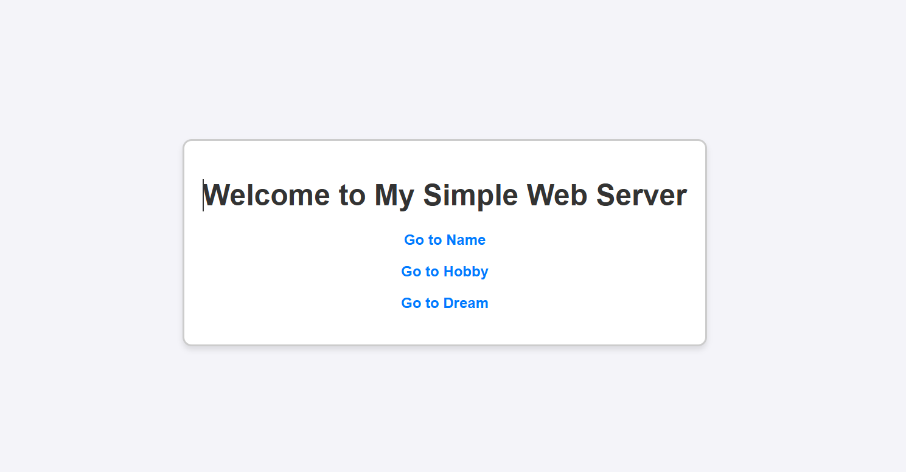
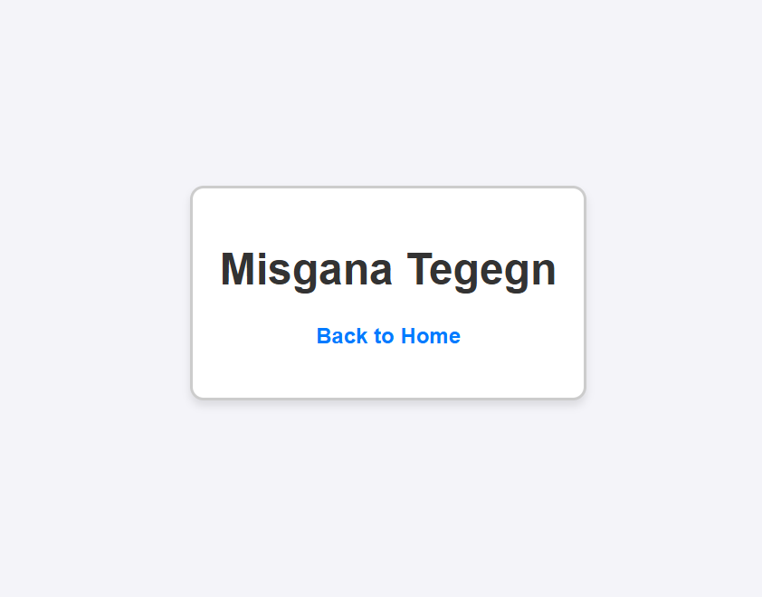
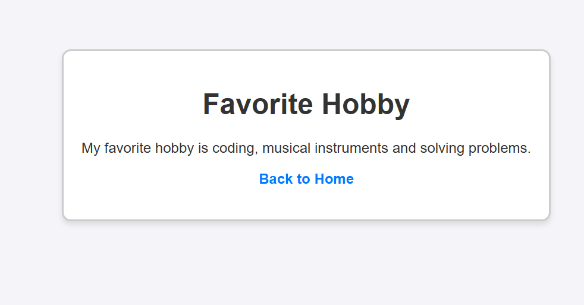
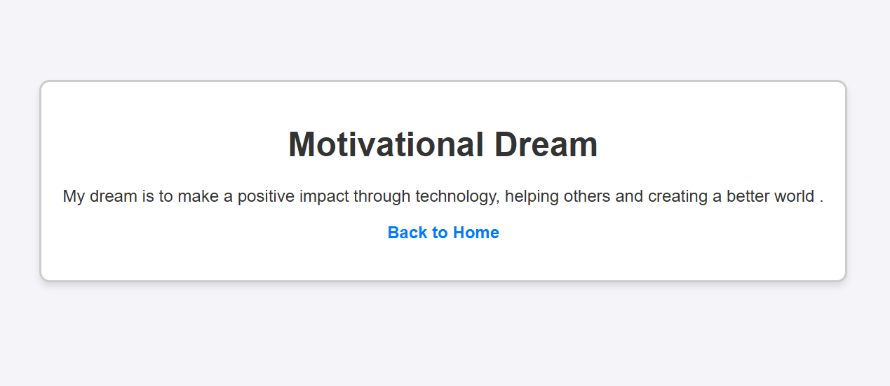

# Simple Web Server

This is a simple Node.js web server built using the Express.js framework. The server provides three routes that return static messages about a name, a hobby, and a motivational dream. It also includes a default route with navigation links for easy navigation.

## Features

- **Three Routes**:
  - `/name`: Display full name.
  - `/hobby`: Displays favorite hobby as a message.
  - `/dream`: Displays a motivational message about a dream or goal.
- **Default Route**: The root (`/`) route includes navigation links to the above routes.
- **Styling**: The server uses basic CSS for a centered layout.

## Installation and Setup

Follow these steps to run the project on your local machine:

1. **Clone the repository**:

   git clone <repository-url>
   cd simple-web-server

2. **then, install dependencies**

# npm install

3. **Run**

# command:- npm start

# Finally Access the Server with below link

http://localhost:3000

simple-web-server/
│
├── public/
│ └── style.css # CSS file for styling the web pages
│
├── server.js # Main server file
│
└── README.md # Project documentation

# Routes

# Route > Method > ~~~~ ~~~~Description

/ GET > Default > ~~~~ ~~~~ route with navigation links.
/name > GET > ~~~~ ~~~~ Returns your full name as a plain text message.
/hobby > GET > ~~~~ ~~~~Displays your favorite hobby.
/dream > GET > ~~~~ ~~~~Displays a motivational message about your dream.

# Built With

Node.js - JavaScript runtime.
Express.js - Web application framework.
Basic CSS for styling.

# Screenshots

# Default Route (/)

## A welcome page with navigation links to all other routes.

Author

## /name

Displays full name, centered on the page.

## /hobby

Displays favorite hobby.

## /dream

Displays a motivational message about your dream.

# Author

- Misgana Tegegn
- [github page](https://github.com/proall22/simple_server)

  # Contact me

  ## Contact I’m always open to discussing new projects, collaborations, or sharing knowledge. Feel free to reach out:

  - **Email**: [email](misganategegn0@gmail.com)
  - **LinkedIn**: [linkedin.com/in/misgana-bb46bb288](https://linkedin.com/in/misgana-bb46bb288)
  - **GitHub**: [github.com/proall22](https://github.com/proall22)
  - **Twitter**: [@Misgu2na](https://twitter.com/Misgu2na)
